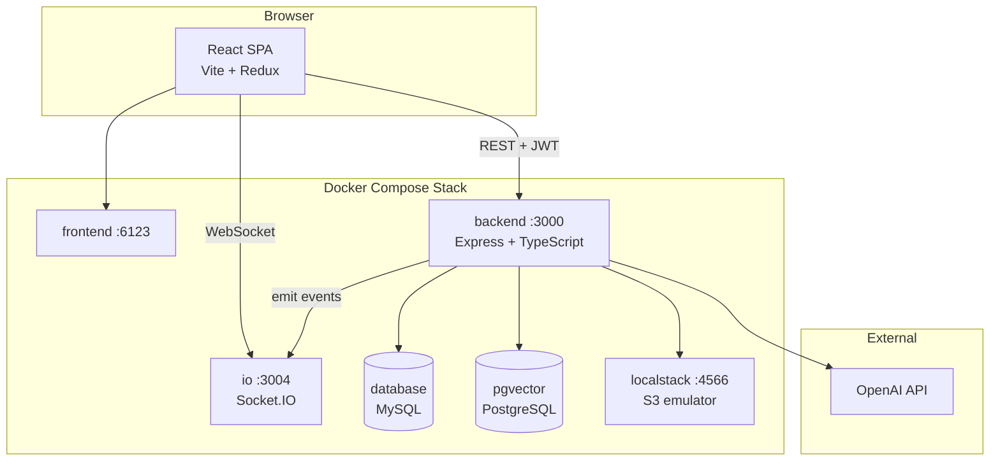
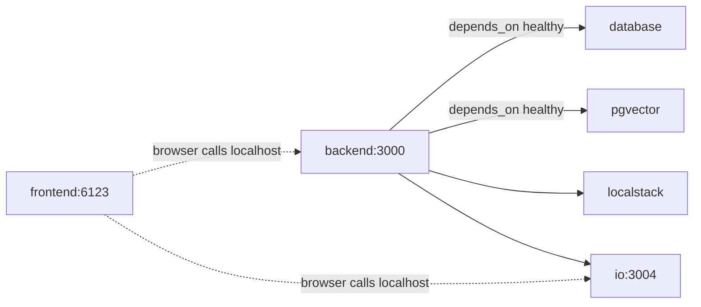

# BetterX — System Architecture

BetterX is a social blogging platform with real-time updates, image uploads, and LLM-powered features for draft improvement, AI image generation, and content moderation.

## High-Level Overview



## Repository Layout

| Path | Role |
|------|------|
| `frontend/` | React 19 SPA (Vite, React Router, Redux Toolkit, React Hook Form, CSS Modules) |
| `backend/` | REST API (Express 5, Sequelize, Joi validation) |
| `io/` | Standalone Socket.IO broadcast server |
| `database/` | MySQL image + seed SQL (`betterx.sql`) |
| `lib/socket-enums/` | Shared WebSocket event name constants |
| `docker-compose.yaml` | Orchestrates all services for local development |
| `ARCHITECTURE.md` | This document |

> **Note:** There is no root `package.json`. Frontend npm commands must be run from `frontend/`.

## Services & Ports

| Service | Container | Host Port | Purpose |
|---------|-----------|-----------|---------|
| `frontend` | `betterx-front-compose` | **6123** → 80 | Nginx serving the production React build |
| `backend` | `betterx-backend-compose` | **3000** | REST API |
| `io` | `betterx-io-compose` | **3004** | Real-time event fan-out |
| `database` | `betterx-db-compose` | internal 3306 | Primary relational store (MySQL) |
| `pgvector` | `pgvector-compose` | **5432** | Vector store for content-guideline embeddings |
| `localstack` | `localstack-compose` | **4566** | Local AWS S3-compatible object storage |

## Frontend Architecture

**Stack:** React 19 + TypeScript + Vite 8, Redux Toolkit, React Router 7, React Hook Form, Socket.IO client, CSS Modules per component.

**Styling:** No UI component library. A token-based design system lives in `frontend/src/index.css`; each component has a co-located `.css` file.

### Composition

```
App
├── BrowserRouter
├── Redux Provider
├── Auth (JWT context)
│   └── Io (Socket.IO listener)
│       └── Layout
│           ├── Login (unauthenticated)
│           └── Header / Following / Followers / Main / Footer
```

### Component Map

| Area | Key components | Responsibility |
|------|----------------|----------------|
| `components/app/` | `App` | Root shell, router + Redux + auth wiring |
| `components/auth/` | `Auth`, `Login` | JWT context, sign-in screen |
| `components/common/` | `Logo`, `Spinner`, `SpinnerButton` | Shared UI primitives |
| `components/layout/` | `Layout`, `Header`, `Main`, `Footer`, `NotFound` | App shell, navigation, routing outlet |
| `components/follows/` | `Following`, `Followers`, `Follow` | Social graph sidebars |
| `components/posts/` | `Profile`, `Feed`, `Post`, `NewPost`, `UpdatePost`, `Comments`, `NewComment`, `PostComment`, `ContentGuidelinesModal` | Posts, comments, LLM draft tools |
| `components/io/` | `Io` | Socket.IO event listener → Redux dispatch |
| `services/` | `auth`, `auth-aware/*` | REST API clients |
| `redux/` | `profile-slice`, `following-slice`, `followers-slice` | Client state |

### Routes (`Main.tsx`)

| Route | Component | Description |
|-------|-----------|-------------|
| `/` | redirect → `/profile` | Default landing |
| `/profile` | `Profile` | User profile + new post form |
| `/feed` | `Feed` | Posts from followed users |
| `/update-post/:postId` | `UpdatePost` | Edit existing post |
| `*` | `NotFound` | 404 page |

### State Management

- **Redux slices:** `profile`, `following`, `followers` — hold posts and social graph data.
- **Auth context:** JWT token, `clientId` for deduplicating self-triggered socket events.
- **Services:** `AuthAware` base class wraps authenticated `fetch` calls to the REST API.

### UI & Design System

The frontend uses a production-style SaaS/social UI built with CSS only (no Tailwind, MUI, etc.).

**Central tokens** (`frontend/src/index.css`):

| Category | Examples |
|----------|----------|
| Brand colors | `--color-primary-500` … `--color-primary-900` (blue palette) |
| Neutrals | `--color-bg`, `--color-surface`, `--color-border` |
| Text | `--color-text`, `--color-text-muted`, `--color-text-subtle` |
| Semantic | `--color-danger`, `--color-success`, `--color-ai` |
| Layout | `--header-height`, `--sidebar-width`, `--content-max-width` |
| Spacing / radius / shadows | `--space-*`, `--radius-*`, `--shadow-*` |

**Shared utility classes:** `form-group`, `form-label`, `form-error`, `section-title`, `empty-state`, `btn-secondary`, `btn-danger`, `btn-success`, `btn-ai`, `btn-ghost`.

**Brand logo** (`components/common/logo/Logo.tsx`):

- Mark: blue gradient rounded square with white **BX** letters.
- Wordmark: **BetterX** (optional via `showText` prop).
- Sizes: `sm` (header/footer), `md` (default), `lg` (login page).
- Favicon: `frontend/public/favicon.svg` (matching BX mark).

**Layout behavior:**

| Breakpoint | Layout |
|------------|--------|
| Desktop (>1024px) | Sticky header, left sidebar (Following + Followers), centered main content |
| Tablet (768–1024px) | Narrower sidebar |
| Mobile (<768px) | Single-column stack: header → following → followers → main → footer |

**Key UI surfaces:**

- **Login** — full-screen gradient background, centered auth card, labeled inputs.
- **NewPost** — form with AI assistant panel (`Improve`, `Generate Pic`, `User Improve`); AI buttons use `btn-ai` variant.
- **Post** — card with 16:9 image, metadata, comment section, update/delete actions.
- **Follow** — horizontal user tile with avatar, name, @username, follow/unfollow button.

### Environment Variables

| Variable | Docker value | Purpose |
|----------|--------------|---------|
| `VITE_REST_SERVER_URL` | `http://localhost:3000` | Backend API base URL |
| `VITE_IO_SERVER_URL` | `http://localhost:3004` | Socket.IO server URL |

Defined in `frontend/.env.docker` (Docker build) and `frontend/.env.development` (local dev).

### Frontend Build & Dev

```bash
cd frontend
npm install          # first time only
npm run dev          # local dev server (Vite HMR)
npm run build        # production build
npm run build:docker # build with .env.docker (used by Dockerfile)
```

Docker rebuild after CSS/UI changes:

```bash
# from project root
docker compose up --build -d frontend
```

## Backend Architecture

**Stack:** Express 5, Sequelize-TypeScript, Joi, OpenAI SDK, AWS SDK v3.

### Startup Sequence (`app.ts`)

1. Register middleware and routers.
2. `sequelize.sync()` — ensure MySQL tables exist.
3. `pgvector.sync()` — ensure PostgreSQL tables exist.
4. `initGuidelinesEmbeddings()` — embed and store content guidelines in pgvector.
5. `createAppBucketIfNotExist()` — create S3 bucket on LocalStack.
6. Listen on port 3000.

### Configuration

Uses the [`config`](https://www.npmjs.com/package/config) package with layered JSON files:

| File | When used |
|------|-----------|
| `default.json` | Base settings |
| `compose.json` | `NODE_ENV=compose` (Docker Compose) |
| `docker.json` | `NODE_ENV=docker` (standalone backend container) |
| `custom-environment-variables.json` | Maps env vars to config keys |

Key env vars:

| Env var | Config key | Required for |
|---------|------------|--------------|
| `BETTERX_OPENAI_API_KEY` | `openai.apiKey` | Backend startup + all LLM features |
| `BETTERX_PORT` | `app.port` | Optional port override |
| `BETTERX_DB_PASSWORD` | `db.password` | Optional DB password |

### API Routes

| Prefix | Auth | Endpoints |
|--------|------|-----------|
| `/auth` | Public | `POST /signup`, `POST /login` |
| `/feed` | JWT | Feed from followed users |
| `/follows` | JWT | Follow / unfollow users |
| `/profile` | JWT | CRUD posts, multipart image upload |
| `/comments` | JWT | CRUD comments on posts |
| `/drafts` | JWT | LLM draft & image generation |

### Middleware Pipeline (example: create post)

```
bodyValidation → guidelinesViolationPreventor → filesValidation → fileUploader → createPost
```

### Data Layer

**MySQL (Sequelize models):**

| Model | Table | Purpose |
|-------|-------|---------|
| `User` | `users` | Accounts |
| `Post` | `posts` | Blog posts with optional `imageUrl` |
| `Comment` | `comments` | Post comments |
| `Follow` | `follows` | Follow relationships |
| `ChatMessage` | `chat_messages` | LLM user-improve conversation history |

**PostgreSQL + pgvector:**

| Model | Table | Purpose |
|-------|-------|---------|
| `ContentGuideline` | `content_guidelines` | Embedded policy documents (profanity, medical, crypto) |

Closest-guideline lookup uses cosine distance: `ORDER BY vector <=> $1 LIMIT 1`.

### File Storage

Post images are uploaded via `express-fileupload`, validated (JPEG/PNG), then stored in S3 (LocalStack in dev) using `@aws-sdk/lib-storage`. The resulting URL is persisted on the `Post` record.

### Real-Time Events

The backend emits Socket.IO events (via `socket.io-client` to the `io` service) on actions like new posts, follows, and comments. Event names are defined in `lib/socket-enums`:

- `NEW_POST`
- `NEW_FOLLOW`
- `UNFOLLOW`
- `NEW_COMMENT`

## LLM Features

All LLM calls go through `backend/src/openai/openai.ts` using the OpenAI SDK.

### 1. Draft Improvement (`POST /drafts/improve`)

One-shot grammar/clarity enhancement of a post body using `gpt-4.1-mini`.

### 2. User-Guided Improvement (`POST /drafts/user-improve`)

Conversational editing: accepts a `prompt`, `body`, and `chatId`. Loads prior `ChatMessage` history, applies user instructions, and persists the exchange.

### 3. AI Image Generation (`POST /drafts/pic`)

Generates a 1024×1024 image via `gpt-image-1` from the post title and body. Returns `{ base64 }`. The frontend converts this to a `File` and submits it through the existing multipart `POST /profile` flow.

### 4. Content Moderation (`guidelinesViolationPreventor`)

Runs before post creation:

1. Embed post title + body (`text-embedding-3-small`).
2. Find nearest content guideline in pgvector.
3. Ask `gpt-4.1-mini` whether the post violates that policy.
4. Reject with HTTP 422 if the model returns `"true"`.

Guideline documents live in `backend/src/content-guidelines/` (mirrored in the frontend for display in `ContentGuidelinesModal`).

## IO Server

A minimal Socket.IO server (`io/src/server.ts`) that:

- Listens on port 3004.
- Accepts any event from a connected client.
- Re-broadcasts that event to **all** connected clients.

This creates a simple pub/sub bus between backend emitters and frontend listeners.

## Docker Compose Topology



- **backend** waits for `database` and `pgvector` healthchecks before starting.
- **backend** receives `BETTERX_OPENAI_API_KEY` from the host environment via `docker-compose.yaml`.
- **localstack** has no explicit `depends_on` — backend retries on connection failure.
- Internal DNS: services reference each other by service name (`database`, `pgvector`, `localstack`, `io`).

### Running the Stack

```bash
# From project root
export BETTERX_OPENAI_API_KEY=sk-your-key-here   # required — do not commit this
docker compose up --build -d
```

Access the app at **http://localhost:6123**.

> **Note:** The backend initializes pgvector guideline embeddings via OpenAI at startup, so `BETTERX_OPENAI_API_KEY` must be set in your shell before `docker compose up`. If the key is missing, the backend container will crash with `Missing credentials`.

Restart only the backend after setting the key:

```bash
export BETTERX_OPENAI_API_KEY=sk-your-key-here
docker compose up -d backend
```

Rebuild only the frontend after UI changes:

```bash
docker compose up --build -d frontend
```

### Stopping

```bash
docker compose down
```

### Common Mistakes

| Mistake | Fix |
|---------|-----|
| `npm run build` from project root | Run from `frontend/`: `cd frontend && npm run build` |
| Backend crashes on startup | Export `BETTERX_OPENAI_API_KEY` before `docker compose up` |
| UI changes not visible in Docker | Rebuild frontend: `docker compose up --build -d frontend` |
| `npm run i` | Use `npm install` inside `frontend/` |

## Authentication Flow

1. User signs up or logs in via `POST /auth/signup` or `POST /auth/login`.
2. Backend returns a JWT signed with `app.encryptionKey`.
3. Frontend stores the token and sends `Authorization: Bearer <jwt>` on protected requests.
4. `authEnforce` middleware verifies the JWT and sets `request.userId`.

`/auth` routes are registered **before** `authEnforce`; all other routes require a valid token.

## Key Design Decisions

- **Dual databases:** MySQL for relational app data; PostgreSQL + pgvector for semantic similarity search over moderation policies.
- **LocalStack for S3:** Enables full image-upload flow without real AWS credentials.
- **Separate IO service:** Decouples WebSocket fan-out from the REST API process.
- **AI image → existing upload path:** Base64 from `/drafts/pic` is converted client-side to a `File`, so no backend changes were needed for AI-generated images.
- **RAG-style moderation:** Embeddings select the most relevant policy; the LLM then evaluates the post against that specific guideline.
- **CSS Modules + design tokens:** Component-scoped styles with a shared token layer in `index.css` — no external UI framework, fast builds, full control over the visual system.
- **Monorepo-style layout without root package:** Each service (`frontend`, `backend`, `io`) has its own `package.json` and build pipeline; Docker Compose ties them together.
